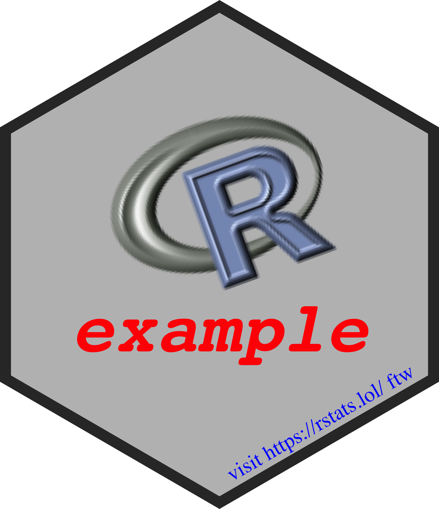

# {gex}

<!-- badges: start -->
[](https://www.repostatus.org/#active)
[](https://github.com/matt-dray/gex/actions/workflows/R-CMD-check.yaml)
<!-- badges: end -->

## What

An R package to help create simple hexagon-shaped sticker logos with the dimensions of [the Stickers Standard](https://sticker.how/#type-hexagon).

{gex}:

* is dependency-lightweight
* lets you add as many text and image elements as you like
* uses the grid graphics system, so is 'extensible'

The package does what I need it to do but is not fully tested across all systems.
[Please contribute](https://github.com/matt-dray/gex/issues) if you have bug reports or ideas.

## Install

You can install {gex} [from GitHub](https://github.com/matt-dray/gex) like:

``` r
install.packages("remotes")  # if not yet installed
remotes::install_github("matt-dray/gex")
```

The package uses the inbuilt {grid} graphics system and the sister package [{gridGeometry}](https://cran.r-project.org/package=gridGeometry).
The package may include more 'gridverse' packages in future.

## Example

Build a sticker additively with a series of function calls:

1. `open_device()` to set up a PNG graphics device with the dimensions of [the Stickers Standard](https://sticker.how/#type-hexagon).
1. `add_hex()` to add the underlying hexagon 'canvas'.
1. `add_image()` to place an image (run multiple times for more images).
1. `add_text()` to place and style text (run multiple times for more text).
1. `add_border()` to put a border around the edge of the hex (add this after images and text to draw over the top of them).
1. `close_device()` to close the PNG graphics device and save to file.

You can set various text and image properties like position, size, colour and angle.
Text and images will be clipped if they exceed the boundary of the hexagon.

It's up to the user to read their own images (via {[png](https://cran.r-project.org/package=png)} or {[jpeg](https://cran.r-project.org/package=jpeg)}) and install the fonts they want to use.

Below is an extremely basic example.
Note how you call each function independently, much like writing base plots.

``` r
# Somewhere to save it
temp_path <- tempfile(fileext = ".png")

# Bring your own image
image_path <- system.file("img", "Rlogo.png", package = "png")
image_png <- png::readPNG(image_path)

# Build and write the hex
gex::open_device(file_path = temp_path)
gex::add_hex(col = "#BEBEBE")  # named or hexadecimal
gex::add_image(
  img = image_png,
  y = 0.6,  # 0 to 1 on x and y axes
  angle = 20,
  width = 0.5
)
gex::add_text(
  string = "example",
  y = 0.35,
  col = "red",
  family = "mono",  # bring your own font
  face = "bold.italic"
)
gex::add_text(  # add multiple text and images
  string = "visit https://rstats.lol/ ftw",
  x = 0.73, 
  y = 0.17,
  angle = 30, 
  size = 6, 
  col = "blue", 
  family = "serif"
)
gex::add_border(col = "grey20")
gex::close_device()  # writes to file
```

That creates this absolutely stunning sticker, written to the specified `file_path`:



Note that you can't rely on plot-window previews when you're developing your sticker (they lie).
You must inspect the generated PNG file instead.
From R, you could do this with a `system()` call:

``` r
# Open the PNG hex image for inspection
system(paste("open", temp_path))
```

## Related

For more established hex-making tools with R, try:

* [{hexSticker}](https://github.com/GuangchuangYu/hexSticker) by Guangchuang Yu
* [{bunny}](https://github.com/dmi3kno/bunny) by Dmytro Perepolkin
* the [hexmake](https://connect.thinkr.fr/hexmake/) Shiny app by Colin Fay
